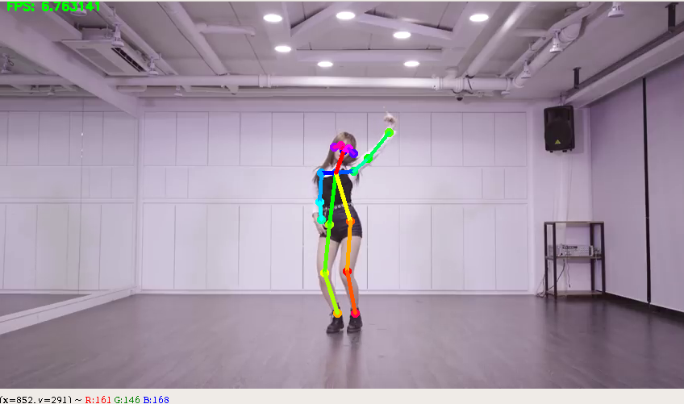

# Installing 

```
OS: Ubuntu 18.04
GPU: GeForce GTX 1050 Ti
```

### Install CUDA 9.0

download : https://drive.google.com/file/d/1cmHoAhMPHdUN3x87bDZx0-YKgkkiNuxS/view?usp=sharing
```
$ sudo dpkg -i cuda-repo-ubuntu1704-9-0-local_9.0.176-1_amd64.deb
$ sudo apt-key add /var/cuda-repo-9-0-local/7fa2af80.pub
$ sudo apt-get update
$ sudo apt-get install cuda=9.0.176-1
```

```
$ sudo nano ~/.bashrc

# CUDA 9.0
export CUDA_HOME=/usr/local/cuda
export PATH=$CUDA_HOME/bin:$PATH
export LD_LIBRARY_PATH=$CUDA_HOME/lib64:$LD_LIBRARY_PATH
# END CUDA 9.0

$ source ~/.bashrc
$ nvcc -V
nvcc: NVIDIA (R) Cuda compiler driver
Copyright (c) 2005-2017 NVIDIA Corporation
Built on Fri_Sep__1_21:08:03_CDT_2017
Cuda compilation tools, release 9.0, V9.0.176
```

### Install CuDNN 7.0.5

download : https://drive.google.com/file/d/1cmHoAhMPHdUN3x87bDZx0-YKgkkiNuxS/view?usp=sharing
```
$ tar -xzvf cudnn-9.0-linux-x64-v7.tgz
$ cd cudnn-9.0-linux-x64-v7
$ sudo cp cuda/include/cudnn.h /usr/local/cuda/include
$ sudo cp cuda/lib64/libcudnn* /usr/local/cuda/lib64
$ sudo chmod a+r /usr/local/cuda/include/cudnn.h /usr/local/cuda/lib64/libcudnn*
```
### Install Miniconda

download : https://drive.google.com/file/d/1PBc5ZYVfwAZ5HVEyJiqAiMhU2icz1F2J/view?usp=sharing
```
$ Bash Miniconda3-latest-Linux-x86_64.sh
```

### Install tf-pose-estimation

```
$ git clone https://github.com/newler55/tf-pose-estimation.git
$ cd tf-pose-estimation

$ sudo apt install swig
$ cd tf_pose/pafprocess
$ swig -python -c++ pafprocess.i && python3 setup.py build_ext --inplace

$ conda create -n ai python=3.6 pip | conda activate base , conda remove -n ai --all
$ pip install -r requirements.txt
```

Test Inference
```
$ python run_webcam.py
```
<p align="center"></p>

